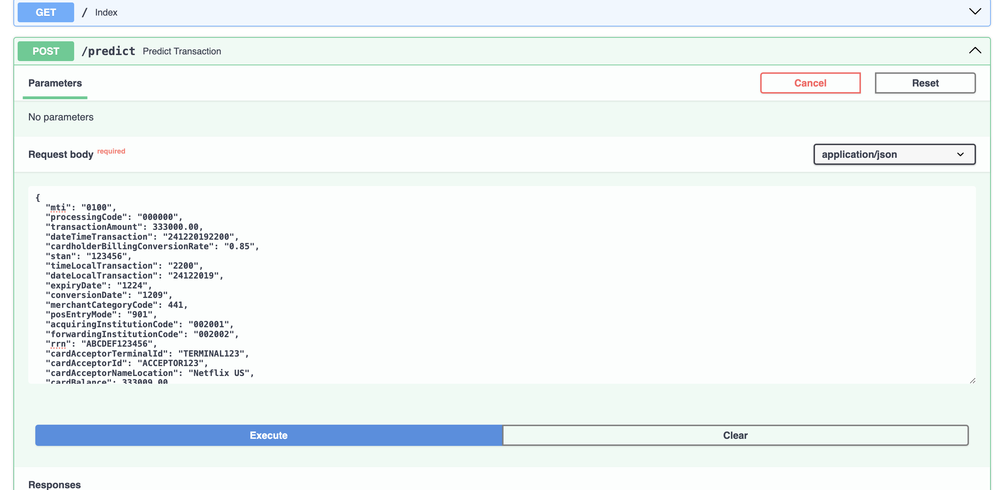
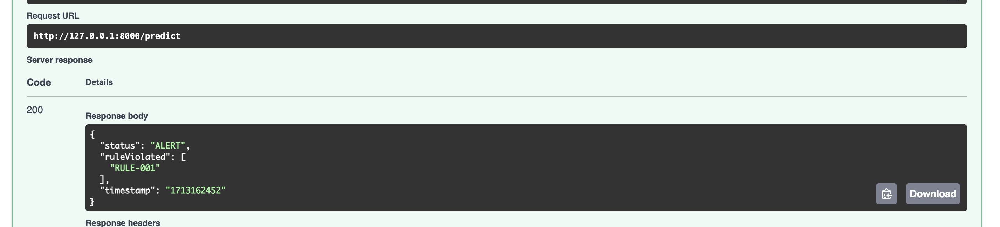

#dataset
https://www.kaggle.com/code/shubhamlipare/credit-card-fraud-detection-supervised-ml

implementation:
https://github.com/shivam1808/Credit-Card-Fraud-Detection/blob/master/Anamoly%20Detection.ipynb

rule1:

